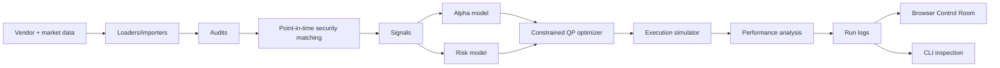

# Architecture

Related docs: [Documentation Contents](docs/CONTENTS.md), [CLI Command Reference](docs/CLI_REFERENCE.md), [Math Reference](docs/MATH.md), [Worked Examples](docs/WORKED_EXAMPLES.md), [Factor Math Guide](docs/FACTORS.md), [Config Reference](docs/CONFIG.md), [Glossary](docs/GLOSSARY.md), [Python Module Reference](docs/PYTHON_REFERENCE.md).

## Pipeline



## 1. Data And Signals

The data layer models the unglamorous but critical part of quant systems: loading, cleaning, coverage checks, and identifier mapping. `security_master.py` includes a point-in-time entity matcher so vendor data can be mapped to internal security IDs only during valid date ranges.

`data/real_data.py` provides real-data entry points:

- `import_price_csv(...)` for local OHLCV/fundamental/vendor CSVs.
- `download_yfinance_bundle(...)` for Yahoo Finance daily OHLCV ingestion.
- `download_yfinance_rich_bundle(...)` for OHLCV plus optional actions, fundamentals, earnings, analysts, profile, holders, and option snapshots.

Download settings are stored as YAML under `configs/downloads/`. Download manifests are written next to downloaded data under `data/<bundle>/download_manifest.json` so the browser Data tab can show timestamps, requested settings, downloaded tickers, and skipped tickers.

The canonical bot schema is:

```text
prices.csv
fundamentals.csv
security_master.csv
vendor_entities.csv
entity_mapping.csv
```

When real fundamentals or vendor signals are missing, neutral placeholder files are written so the pipeline can still run. This is schema support, not a claim that missing signals contain predictive value.

## 2. Alpha Production

`factors/signals.py` converts raw market, fundamental, and vendor-style data into cross-sectional factor scores. `factors/alpha.py` combines scores using fixed research priors and rolling information-coefficient estimates that only use historical observations before the current rebalance date.

## 3. Risk Model

`risk/model.py` estimates a factor covariance model with market, sector, and style exposures. This is more scalable than estimating every pairwise stock covariance directly and mirrors the outline's motivation for factor risk.

## 4. Portfolio Construction

`portfolio/optimizer.py` solves a constrained quadratic program. The decision vector is:

$$
x=[w,u,g]
$$

where:

- `w_i` is target portfolio weight.
- `u_i` is an auxiliary variable for `|w_i-current_i|`.
- `g_i` is an auxiliary variable for `|w_i|`.

The base QP is:

$$
\min_w
-\mu^\top w
+\frac{1}{2}\lambda w^\top\Sigma w
+\eta c^\top u
$$

subject to:

$$
\sum_i w_i=target\_net\_exposure,\quad
\sum_i g_i\le gross\_limit,\quad
\sum_i u_i\le max\_turnover
$$

$$
-max\_position\_abs\le w_i\le max\_position\_abs
$$

$$
u_i\ge w_i-current_i,\quad
u_i\ge -w_i+current_i,\quad
g_i\ge w_i,\quad
g_i\ge -w_i
$$

Optional sector neutrality is:

$$
X^\top w=0
$$

The solver uses the same convex QP formulation through either CVXPY/OSQP, when installed, or the bundled SciPy SLSQP fallback. The formulation remains a true convex QP as long as the covariance matrix is positive semidefinite; the implementation eigenvalue-clips tiny negative sample-covariance artifacts.

The default config uses `solver: auto`, so installing the `qp` extra enables the faster OSQP path. If OSQP returns `optimal_inaccurate`, `solver: auto` captures the CVXPY warning, retries with SciPy SLSQP, and records the fallback in the run logs.

## 5. Implementation And Trading

`execution/simulator.py` converts target portfolio changes into simulated implementation shortfall using commission, spread, and simple market-impact assumptions. No live broker integration is included.

## 6. Performance Analysis

`analysis/performance.py` computes total return, annualized return, volatility, active risk, information ratio, drawdown, average turnover, and estimated implementation shortfall.

## 7. Browser And CLI Control Layer

`web.py` serves the browser Control Room with the stdlib `ThreadingHTTPServer`. Static assets live under `src/quantbot/web_static/`, while JSON endpoints expose configs, download settings, ticker groups, data bundles, run outputs, jobs, CLI execution, CLI usage history, and docs.

Serve locally:

```bash
quantbot serve --host 127.0.0.1 --port 8000
```

Serve to the LAN:

```bash
quantbot serve --host 0.0.0.0 --port 8000
```

Job state is held in memory by `JobStore`, with cooperative checkpoints for progress, pause, resume, and cancellation. Backtest outputs are timestamped by source so GUI and CLI runs do not overwrite each other by default.

The Runs page reads saved CSV outputs directly and renders the dashboard natively in the browser. The Docs page reads `README.md` and `docs/*.md` through a safe read-only API, emits LaTeX delimiters for inline and display math, and lets MathJax typeset equations when the browser can reach the CDN. If MathJax is unavailable, the same TeX remains readable in styled math blocks. Docs can be downloaded as individual Markdown files, as a ZIP bundle, or as a standalone offline HTML docs browser generated by the same server-side docs exporter used by `quantbot docs export`.

CLI usage is logged by `usage_log.py` into `logs/cli_usage.jsonl`. CLI job metadata is logged into `logs/cli_jobs.jsonl`, and captured command output is written under `logs/cli_output/`. Real terminal commands use source `cli`; browser-entered commands use source `gui_cli`. The same history is available through the browser CLI page and through `quantbot cli-usage` / `quantbot cli-jobs`.

## Scaling Notes

This scaffold uses CSV to stay runnable anywhere. A larger version would commonly use partitioned Parquet/Delta for research/batch data and a low-latency time-series store for live or intraday data. Spark/Databricks-style distributed execution would fit behind the loader and factor computation interfaces without changing the conceptual pipeline.
